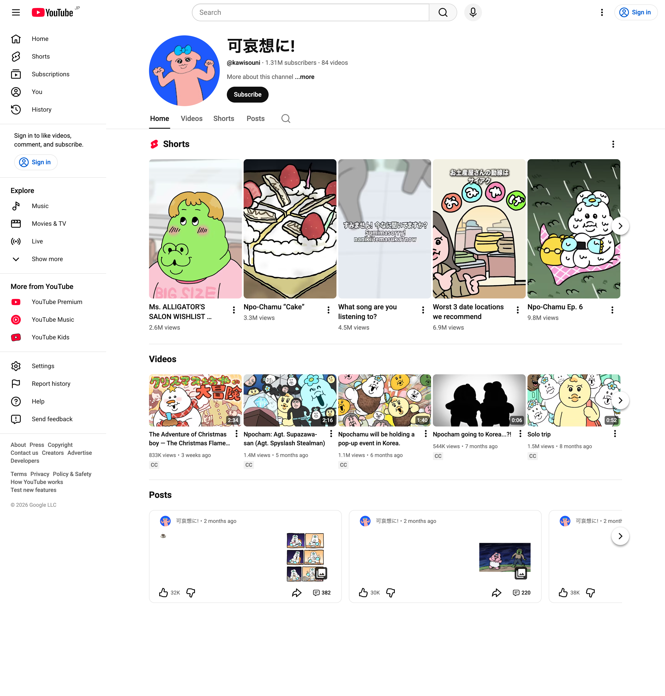
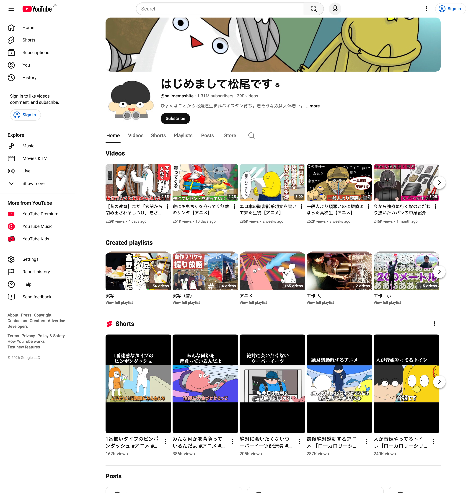
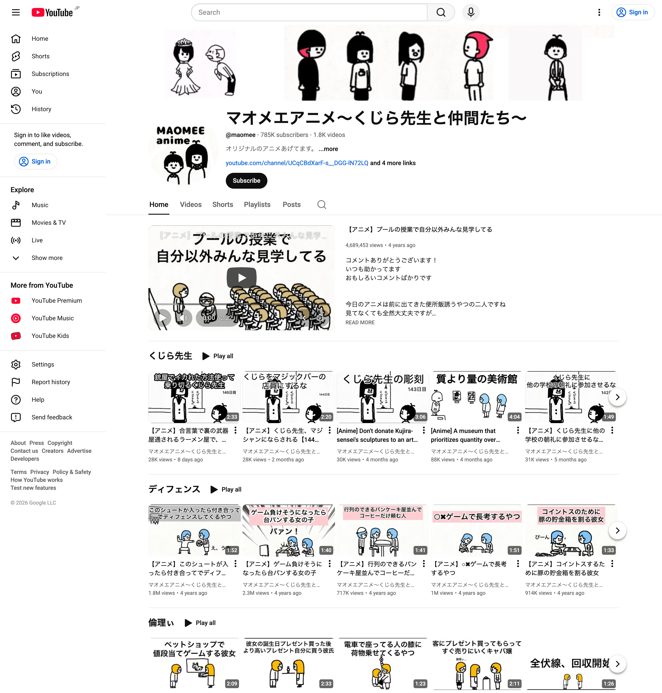

# Z世代向けショートアニメ テーマ分析レポート

> **作成日**: 2026-01-16
> **目的**: 成功しているショートアニメのテーマ分析から、視聴者目線のコンテンツ方針を策定する

---

## 1. 成功事例分析：5つのショートアニメ

### 1.1 可哀想に！（おぱんちゅうさぎ）

| 項目 | 内容 |
|------|------|
| **登録者数** | 131万人 |
| **テーマ** | 「報われない毎日でも、頑張ってる自分を肯定したい」 |
| **テーマ分類** | 共感型 |
| **コアコンセプト** | 不憫かわいい（ふびんかわいい） |
| **視聴者価値** | 自分の日常の苦労を代弁してくれる存在 |

**成功要因**:
- 「頑張っても報われない」という現代人の共通体験を可視化
- 可哀想な状況なのに可愛い → 応援したくなる心理
- ネガティブな感情をポジティブなエンタメに昇華

---

### 1.2 はじめまして松尾です

| 項目 | 内容 |
|------|------|
| **登録者数** | 131万人 |
| **テーマ** | 「意味不明だけど、なぜか笑える」 |
| **テーマ分類** | 中毒型 |
| **コアコンセプト** | シュール × 高速テンポ × ボキャブラリー暴力 |
| **視聴者価値** | 頭を空っぽにして笑える |

**成功要因**:
- 関西弁のツッコミとボケの高速展開
- 「ワード回収」の快感（伏線回収のショート版）
- スクショ映えする表情・テキスト・構図の最適化
- アドベンチャータイム等の影響を受けたシュールな世界観

---

### 1.3 そろ谷のアニメっち

| 項目 | 内容 |
|------|------|
| **登録者数** | 108万人 |
| **テーマ** | 「哀愁ゼロのコントアニメ」 |
| **テーマ分類** | 中毒型 |
| **コアコンセプト** | 関西弁 × ハイテンポ × 軽快なツッコミ |
| **視聴者価値** | テンポの良い掛け合いで頭を空っぽにして笑える |

**成功要因**:
- プロのアニメ監督（そろ谷）による1人制作体制
- 関西弁の軽快なテンポと独特のユーモア
- ハイテンポの会話やツッコミを歌うリズムネタ
- 「ケツアゴ姉さん」等の個性的なキャラクター

---

### 1.4 マリマリマリー

| 項目 | 内容 |
|------|------|
| **登録者数** | 177万人 |
| **テーマ** | 「エモいのに、くだらない」 |
| **テーマ分類** | ギャップ型 |
| **コアコンセプト** | シティポップ風ビジュアル × ローカロリーな笑い |
| **視聴者価値** | おしゃれな雰囲気で見やすく、何度でも見返せる |

**成功要因**:
- 90年代シティポップ風の高彩度ビジュアル（差別化戦略）
- 「面白いことを面白い絵で描く」競合を避け、「おしゃれ×くだらない」のギャップ
- 4人のキャラクターによる掛け合い（カナメ、レイジ、スミ、ミズキ）
- 「ローカロリー」＝ 何度見ても疲れない軽さ

---

### 1.5 マオメエアニメ

| 項目 | 内容 |
|------|------|
| **登録者数** | 78.5万人 |
| **テーマ** | 「くじら先生と仲間たちの、シュールな日常」 |
| **テーマ分類** | 中毒型 |
| **コアコンセプト** | ゆるかわキャラ × 悪戯 × 予測不能な展開 |
| **視聴者価値** | 癒し系の見た目から予想外の展開で笑う |

**成功要因**:
- 主人公「くじら先生」を中心としたキャラクター群
- 悪戯や予測を裏切るシュールな展開
- ゆるい絵柄と過激な内容のギャップ
- 繰り返し視聴を誘発する中毒性

---

## 2. テーマ分類フレームワーク

分析結果から、成功パターンを4つに分類：

| 分類 | 視聴者の欲求 | 代表例 | 特徴 |
|------|-------------|--------|------|
| **共感型** | 自分を肯定してほしい | 可哀想に！ | 日常の苦労を代弁、応援したくなる |
| **中毒型** | 頭を空っぽにしたい | 松尾です、そろ谷、マオメエ | シュール、意味不明、でも見てしまう |
| **爽快型** | スカッとしたい | （該当なし） | あるある→予想外のオチで笑う |
| **ギャップ型** | おしゃれに笑いたい | マリマリマリー | 見た目と内容の落差が面白い |

---

*本レポートはクマーバチャンネルの「テーマから考える」方法論に基づき作成*
